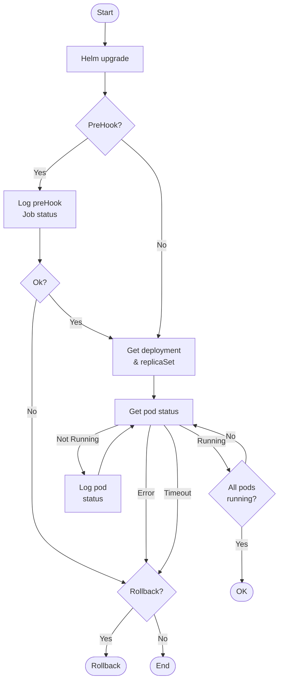

# K8sUtils PowerShell Module <!-- omit in toc -->

- [How It Works](#how-it-works)
- [Using it in an Azure DevOps Pipeline](#using-it-in-an-azure-devops-pipeline)
- [Testing `Invoke-HelmUpgrade`](#testing-invoke-helmupgrade)
  - [run.ps1 Tasks](#runps1-tasks)
  - [Kubernetes Manifests](#kubernetes-manifests)
  - [Scenarios](#scenarios)
  - [Pester Test Coverage](#pester-test-coverage)
  - [Test helm chart](#test-helm-chart)

This PowerShell module has helpers for working with Kubernetes (K8s) and Helm. It was created to solve a problem when using `helm -wait` in a CI/CD pipeline. `-wait` is wonderful in that your pipeline will wait for a successful deployment, but if anything goes wrong, it will wait for the timeout and then return an error. At that point, you may have lost all the logs and events that could help diagnose the problem and then have to re-run the deployment and baby sit it to try to catch the logs or events that caused the timeout.

With `Invoke-HelmUpgrade` you get similar functionality, but it will capture all the logs and events along the way, and if there is an error, it will return early as possible. No more waiting the 5 or 10 minutes you set on `helm -wait`.

> This proved to be very useful at my company when updating pipelines to deploy to a new K8s cluster. As we worked through the many configuration and permission issues, the pipelines failed quickly with full details of the problem. We rarely had to check K8s. It was a huge time saver.

There are an infinite number of ways helm and its K8s manifests can be configured and error out. This module tries to handle to most common cases, and is amended as more are discovered. It does handle Helm pre-install [hooks](https://helm.sh/docs/topics/charts_hooks/) (preHooks) and K8s [initContainers](https://kubernetes.io/docs/concepts/workloads/pods/init-containers/). See below for a list of all the cases that are tested.

## How It Works

`Invoke-HelmUpgrade` calls `helm upgrade` without `-wait` and then will poll K8s during the various phases of the deployment, capturing events and logs along the way.

## Using it in an Azure DevOps Pipeline

Before the script can run, you need to do the following:

- `kubectl login`
- `helm registry login`
- `Install-Module K8sUtils` if you've registered it or `Import-Module` if you have it locally

I've included a sanitized, opinionated version of a yaml [template](DevOps/AzureDevOpsTask/helm-upgrade.yml) used in an Azure DevOps pipeline. You can adapt it to your needs. It does the following.

1. Logs into K8s using a AzDO Service Connection
2. Logs into the Helm registry (with retries)
3. Pulls K8sUtils from a NuGet repo, and installs it
4. Runs a task to update the `values.yaml` file with parameter values
5. Runs `Invoke-HelmUpgrade` with the updated `values.yaml` file

## Testing `Invoke-HelmUpgrade`

Tests can be run locally using Rancher Desktop or Docker Desktop with Kubernetes enabled. The test scripts deploy the [minimal-api](https://github.com/MrSeekatar/minimal-api) ASP.NET application. Some of these scripts assume it is in a sibling directory, and the Docker image has been built locally.

### run.ps1 Tasks

The `run.ps1` script has the following tasks that you can execute with `.\run.ps1 <task>,...`.

| Task            | Description                                                                           |
| --------------- | ------------------------------------------------------------------------------------- |
| applyManifests  | Apply all the manifests in DevOps/manifests to the Kubernetes cluster                 |
| publishK8sUtils | Publish the K8sUtils module to a NuGet repo                                           |
| upgradeHelm[^1] | Upgrade/install the Helm chart in the Kubernetes cluster using `minimal1_values.yaml` |
| uninstallHelm   | Uninstall the Helm chart in the Kubernetes cluster                                    |

[^1]: The `config-and-secret.yaml` manifest must be applied before running this task.

### Kubernetes Manifests

In the `DevOps/Kubernetes` folder are the following manifests:

| Name                        | Description                                                                              |
| --------------------------- | ---------------------------------------------------------------------------------------- |
| busy-box.yml                | A busybox pod for testing in service-test namespace                                      |
| manifests1.yml              | Creates a deployment, service and ingress with host my-k8s-example1.com                  |
| manifests2.yml              | Creates a deployment, service and ingress with host my-k8s-example2.com                  |
| powershell.yml              | A PowerShell pod for testing in service-test namespace                                   |
| service-test-ns-service.yml | Create minimal3 service to access service 1 in service-test namespace using ExternalName |

> `$env:invokeHelmAllowLowTimeouts=1` to allow short timeouts for testing, otherwise will set min to 120s for prehook and 180s for main

### Scenarios

The following table shows the scenarios of deploying the app with helm and the various ways it can fail. `Crash` means the pod/job actually crashes. `Config` means the pod/job doesn't even start due to some configuration error such as bad image tag, missing environment variable or mount, etc. The Switch column is the switch to `Deploy-Minimal` to make the app fail in that way.

 | Pre-Hook | Init   | Main     | Handled | `Deploy-Minimal` Switches         |
 | -------- | ------ | -------- | :-----: | --------------------------------- |
 | OK       | OK     | OK       |    ✅    |                                   |
 | OK       | OK     | BadProbe |    ✅    | -Readiness '/fail'                |
 | OK       | OK     | Crash    |    ✅    | -Fail                             |
 | OK       | OK     | Config   |    ✅    | -BadSecret or delete cm or secret |
 | OK       | OK     | Config   |    ✅    | -ImageTag zzz                     |
 | OK       | Crash  | n/a      |    ✅    | -InitFail                         |
 | OK       | Config | n/a      |    ✅    | -InitTag zzz                      |
 | Crash    | n/a    | n/a      |    ✅    | -HookFail                         |
 | Config   | n/a    | n/a      |    ✅    | -HookTag zzz                      |

Other cases

| Description                                  | Handled | `Deploy-Minimal` Switches                                         |
| -------------------------------------------- | :-----: | ----------------------------------------------------------------- |
| Replica increase                             |    ✅    | -Replicas 3                                                       |
| Replica decrease                             |    ✅    | -Replicas 1                                                       |
| PreHook timeout                              |    ✅    | -TimeoutSecs 30 -HookRunCount 60                                  |
| Init container timeout                       |    ✅    | -TimeoutSecs 10 -InitRunCount 40 -SkipPreHook                     |
| Main container liveness timeout              |    ✅    | -TimeoutSecs 10 -RunCount 40 -SkipPreHook                         |
| PreHook Job timeout                          |    ✅    | -SkipInit -HookRunCount 100 -HookTimeoutSecs                      |
| Main container timeout                       |    ✅    | -SkipInit -RunCount 100                                           |
| Another operation in progress                |    ✅    | -SkipInit -HookRunCount 100 in one terminal, -SkipInit in another |
| Main container startup timeout               |    ✅    | -SkipInit -TimeoutSec 10 -RunCount 10 -SkipPreHook -StartupProbe  |
| Main container startup times out a few times |    ✅    | -SkipInit -TimeoutSec 60 -RunCount 10 -SkipPreHook -StartupProbe  |
| PreHook Job `restart: onFailure`             |         |                                                                   |
| PreHook Job `activeDeadlineSeconds`          |         |                                                                   |

### Pester Test Coverage

These are the tests in [textMinimalDeploy.tests.ps1](Tools/MinimalDeploy.tests.ps1)

 | Test                                     | `Deploy-Minimal` Switches                                        |
 | ---------------------------------------- | ---------------------------------------------------------------- |
 | Ok, hook, init                           |                                                                  |
 | Ok, hook                                 | -SkipInit                                                        |
 | Ok, init                                 | -SkipPreHook                                                     |
 | Ok                                       | -SkipInit -SkipPreHook                                           |
 | Dry run                                  | -DryRun                                                          |
 | Main crash                               | -SkipInit -SkipPreHook -Fail                                     |
 | Main bad image tag                       | -SkipInit -SkipPreHook -ImageTag zzz                             |
 | Main bad secret name                     | -SkipInit -SkipPreHook -BadSecret                                |
 | Main times out                           | -SkipInit -SkipPreHook -RunCount 100                             |
 | Main startup probe temporarily times out | -SkipInit -SkipPreHook -TimeoutSec 60 -RunCount 10 -StartupProbe |
 | Main startup probe fails                 | -SkipInit -SkipPreHook -TimeoutSec 120 -Readiness '/fail'        |
 | Init container times out                 | -SkipPreHook -TimeoutSec 10 -InitRunCount 50                     |
 | Prehook times out                        | -SkipInit -HookRunCount 100 -PreHookTimeoutSecs 5                |
 | Prehook job crashes                      | -HookFail -TimeoutSecs 20 -PreHookTimeoutSecs 20                 |
 | ?                                        |                                                                  |
 | ?                                        |                                                                  |

### Test helm chart

The `DevOps/Helm` folder has a chart and `minimal1_values.yaml` file that can be used to test the helm chart. The `Invoke-HelmUpgrade` function in the PS module will run the upgrade with parameters to control this.

See the preHookJob.yml for details on its configuration. Currently the `helm.sh/hook-delete-policy` is `before-hook-creation` so it will remain out there after the upgrade, but the `ttlSecondsAfterFinished` will delete it after 30s (or so).

Values to set in the minimal to control the tests, all of these can be set with switches to `Deploy-Minimal`:

| Name                   | Values        | Description                                                                                          |
| ---------------------- | ------------- | ---------------------------------------------------------------------------------------------------- |
| failOnStart            | true or false | The image tag to use for the container, defaults to latest, use a bogus value to make a config error |
| runCount               | number        | How many times to run before being ready with 1s delay                                               |
| image.tag              | string        | The image tag to use for the main container                                                          |
| initContainer.runCount | number        | How many times to run before exiting with 1s delay                                                   |
| initContainer.fail     | false or true | If true runs runCount times, then fails                                                              |
| initContainer.imageTag | string        | The image tag to use for the container, defaults to latest, use a bogus value to make a config error |
| preHook.runCount       | number        | How many times to run before exiting with 1s delay                                                   |
| preHook.fail           | false or true | If true runs runCount times, then fails                                                              |
| preHook.imageTag       | string        | The image tag to use for the container, defaults to latest, use a bogus value to make a config error |
