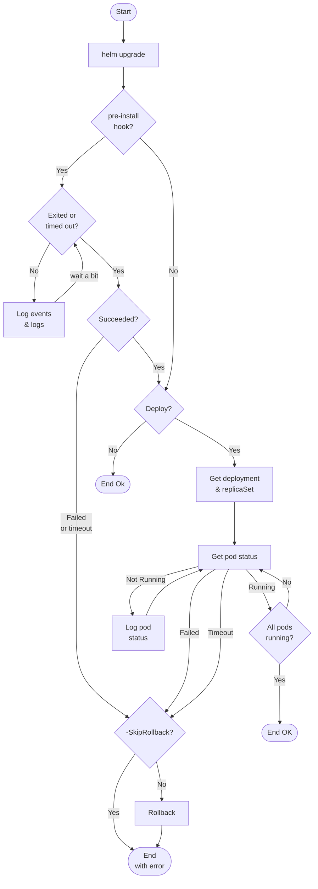
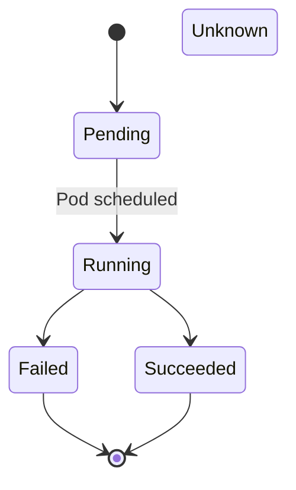
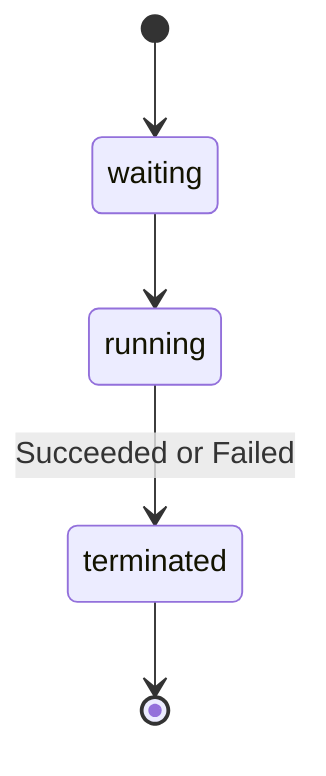

# K8sUtils PowerShell Module <!-- omit in toc -->

K8sUtils is a time-saving PowerShell module for deploying Helm charts and jobs in CI/CD pipelines. It captures all the logs and events of a deployment in the pipeline's output. In the event of a failure, it will return early, instead of timing out. For sample output, see the [wiki](https://github.com/MrSeekatar/K8sUtils/wiki).

> This proved very useful at my company when updating pipelines to deploy to a new K8s cluster. As we worked through the many configuration and permission issues, the pipelines failed quickly with full details of the problem. We rarely had to check K8s. It was a huge time saver.

- [Commands](#commands)
- [Using `Invoke-HelmUpgrade`](#using-invoke-helmupgrade)
  - [Using `Invoke-HelmUpgrade` in an Azure DevOps Pipeline](#using-invoke-helmupgrade-in-an-azure-devops-pipeline)
- [Using `Get-JobStatus`](#using-get-jobstatus)
- [How `Invoke-HelmUpgrade` Works](#how-invoke-helmupgrade-works)
- [Testing `Invoke-HelmUpgrade`](#testing-invoke-helmupgrade)
- [Pod Phases](#pod-phases)
- [Container States](#container-states)
- [Links](#links)

This module was created to solve a problem when using `helm --wait` in a CI/CD pipeline. `--wait` is a wonderful feature that waits for a successful deployment instead of returning immediately after tossing the manifests to K8s. If anything goes wrong, however, with `--wait` Helm will wait until the timeout and then return a timeout error to the pipeline. At that point, you may have lost all the logs and events that could help diagnose the problem and then have to re-run the deployment and babysit it to try to catch the logs or events from K8s.

With `Invoke-HelmUpgrade` you get similar functionality, but it will capture all the logs and events along the way, and if there is an error, it will return as early as possible. No more waiting the 5 or 10 minutes you set on `helm --wait`.

It seems like there are an infinite number of ways Helm and its K8s manifests can be configured and error out. `Invoke-HelmUpgrade` tries to handle the most common cases, and is amended as more are discovered. It does handle Helm pre-install [hooks](https://helm.sh/docs/topics/charts_hooks/) (preHooks) and K8s [initContainers](https://kubernetes.io/docs/concepts/workloads/pods/init-containers/). See [below](#tested-scenarios) for a list of all the covered cases.

One thing required to get prehook logs is to set the `helm.sh/hook-delete-policy` to `before-hook-creation` in the prehook job manifest. This will keep the job around after the upgrade, and the `ttlSecondsAfterFinished` will delete it after 30s, if desired. This is done in the [minimal chart](DevOps/Helm/templates/preHookJob.yaml#L19).

## Commands

Here's a list of the commands in the module with a brief description. Most are called by `Invoke-HelmUpgrade`, but are available for other uses. `help <command>` will show more details.

| Command              | Description                                            |
| -------------------- | ------------------------------------------------------ |
| Add-Annotation       | Helper to add an annotation to a K8s object            |
| Convert-Value        | Substitutes variables in a file with placeholders      |
| Get-DeploymentStatus | Get the status of the pods for a deployment            |
| Get-JobPodSelector   | Get the selector for pods for a job                    |
| Get-JobStatus        | Get the status and logs of a K8s job                   |
| Get-PodByJobName     | Get a pod give a K8s job name                          |
| Get-PodEvent         | Get all the K8s events for a pod                       |
| Get-PodStatus        | Get the status of a pod, dumping events and logs       |
| Invoke-HelmUpgrade   | Calls `helm upgrade` and polls K8s for events and logs |
| Set-K8sUtilsConfig   | Sets type of output wanted for Invoke-HelmUpgrade      |

## Using `Invoke-HelmUpgrade`

You can run `Invoke-HelmUpgrade` from the command line or a CI/CD pipeline. It has a number of parameters to control its behavior, and `help Invoke-HelmUpgrade` will give you all the details. Here's an example using a pre-install hook.

It will log everything it does, as well as K8s events, and pod logs. The events and logs will be output as shown in the [wiki](https://github.com/MrSeekatar/K8sUtils/wiki).

```powershell
$status = Invoke-HelmUpgrade -ValueFile "minimal_values.yaml" `
                             -ChartName "minimal" `
                             -ReleaseName "test"
                             -PreHookJobName "test-prehook"
```

`$status` will be an object that looks like this, serialized to JSON.

```json
{
  "ReleaseName": "test",
  "Running": true,
  "PodStatuses": [
    {
      "PodName": "test-minimal-965698cdc-qzp6s",
      "Status": "Running",
      "ContainerStatuses": "ContainerStatus",
      "InitContainerStatuses": null,
      "LastBadEvents": null,
      "PodLogFile": "/var/folders/wt/48syr7hn5qs3qw_vbs0gl3l00000gn/T/test-minimal-965698cdc-qzp6s.log"
    }
  ],
  "PreHookStatus": {
    "PodName": "test-prehook-f6pbp",
    "Status": "Completed",
    "ContainerStatuses": [
      "ContainerStatus"
    ],
    "InitContainerStatuses": [
      "ContainerStatus"
    ],
    "LastBadEvents": null,
    "PodLogFile": "/var/folders/wt/48syr7hn5qs3qw_vbs0gl3l00000gn/T/test-prehook-f6pbp.log"
  },
  "RollbackStatus": "DeployedOk"
}
```

### Using `Invoke-HelmUpgrade` in an Azure DevOps Pipeline

Before the script can run, you need to do the following in your pipeline's Job:

- `kubectl login`
- `helm registry login`
- `Install-Module K8sUtils` if you've registered it or `Import-Module` if you have it locally

I've included a sanitized, version of a yaml [template](DevOps/AzureDevOpsTask/helm-upgrade.yml) used in an Azure DevOps pipeline. You can adapt it to your needs. It does the following.

1. Logs into K8s using a AzDO Service Connection
1. Installs K8sUtils
1. Runs a task to update the `values.yaml` file with environment variables
1. Runs `Invoke-HelmUpgrade` with the updated `values.yaml` file

## Using `Get-JobStatus`

If you have a job that you want to check the status of, you can use `Get-JobStatus`. It will log everything it does, as well as K8s events, and pod logs. Sample output is on the [wiki](https://github.com/MrSeekatar/K8sUtils/wiki#prehook-output).

```powershell
# minimal parameters
$status = Get-JobStatus -JobName "test-job"
```

`$status` will be an object that looks like this, serialized to JSON.

```json
{
  "PodName": "test-job-qcqfw",
  "Status": "Completed",
  "ContainerStatuses": [
    {
      "ContainerName": "test-job",
      "Status": "Completed",
      "Reason": null
    }
  ],
  "InitContainerStatuses": [
    {
      "ContainerName": "minimal-as-init",
      "Status": "Completed",
      "Reason": null
    }
  ],
  "LastBadEvents": null,
  "PodLogFile": "/var/folders/wt/48syr7hn5qs3qw_vbs0gl3l00000gn/T/test-job-qcqfw.log"
}
```

## How `Invoke-HelmUpgrade` Works

`Invoke-HelmUpgrade` calls `helm upgrade` without `-wait` and then will poll K8s during the various phases of the deployment, capturing events and logs along the way.



## Testing `Invoke-HelmUpgrade`

Tests can be run locally using [Rancher Desktop](https://rancherdesktop.io/) or [Docker Desktop](https://www.docker.com/products/docker-desktop/) with Kubernetes enabled. The Pester test scripts use `Minimal.psm1` helper module to deploy the [minimal-api](https://github.com/MrSeekatar/minimal-api) ASP.NET application, which must be built and pushed to local Docker.

### run.ps1 Tasks <!-- omit in toc -->

The `run.ps1` script has the following tasks that you can execute with `.\run.ps1 <task>,...`.

| Task            | Description                                                                          |
| --------------- | ------------------------------------------------------------------------------------ |
| applyManifests  | Apply all the manifests in DevOps/manifests to the Kubernetes cluster                |
| publishK8sUtils | Publish the K8sUtils module to a NuGet repo                                          |
| test            | Test the `Invoke-HelmUpgrade` function with various scenarios with Pester            |
| upgradeHelm[^1] | Upgrade/install the Helm chart in the Kubernetes cluster using `minimal_values.yaml` |
| uninstallHelm   | Uninstall the Helm chart in the Kubernetes cluster                                   |

[^1]: The `config-and-secret.yaml` manifest must be applied before running this task.

### Kubernetes Manifests <!-- omit in toc -->

In the `DevOps/Kubernetes` folder are the following manifests:

| Name                   | Description                                                              |
| ---------------------- | ------------------------------------------------------------------------ |
| config-and-secret.yaml | ConfigMap and Secret for the minimal1 deployment                         |
| manifests1.yml         | Creates a deployment, service, and ingress with host my-k8s-example1.com |
| manifests2.yml         | Creates a deployment, service, and ingress with host my-k8s-example2.com |

> Set `$env:invokeHelmAllowLowTimeouts=1` to allow short timeouts for testing, otherwise will set the minimum to 120s for prehook and 180s for main. Setting `$env:TF_BUILD=$true` will simulate running in an Azure DevOps pipeline and change header and footer output.

### Tested Scenarios <!-- omit in toc -->

The following table shows the scenarios of deploying the app with Helm and the various ways it can fail. `Crash` means the pod/job actually crashes. `Config` means the pod/job doesn't even start due to a configuration error such as a bad image tag, missing environment variable or mount, etc.

 | Pre-Hook |  Init   |   Main   | Test                                      |
 | :------: | :-----: | :------: | ----------------------------------------- |
 |    OK    |   OK    |    OK    | hook, init ok                             |
 |    OK    |    -    |    OK    | without init ok                           |
 |    -     |   OK    |    OK    | without prehook ok                        |
 |    -     |    -    |    OK    | without init or prehook ok                |
 |    OK    |    -    |    -     | with prehook only ok                      |
 |    -     |    -    | BadProbe | a bad probe                               |
 |    -     |    -    |  Crash   | main container crash                      |
 |    -     |    -    |  Config  | the main container with a bad secret name |
 |    -     |    -    |  Config  | main container has bad image tag          |
 |    OK    |  Crash  |    -     | an init failure                           |
 |    OK    | Config  |    -     | init bad config                           |
 |    -     | Timeout |    -     | init timeout                              |
 |  Crash   |    -    |    -     | prehook job crash                         |
 |  Config  |    -    |    -     | prehook config error                      |
 | Timeout  |    -    |    -     | prehook timeout                           |
 |    -     |    -    | Timeout  | the main container time out               |
 |    -     |    -    | Timeout  | the main container too short time out     |
 |    -     |    -    |    -     | a dry run                                 |
 |    -     |    -    |    OK    | a temporary startup timeout               |
 |    -     |    -    | Timeout  | a startup timeout                         |
 |    -     |    -    |    -     | a prehook job top timeout                 |
 |    -     |    -    |    -     | an init timeout                           |
 |    -     |    -    |    -     | prehook job hook timeout                  |

### Other Scenarios <!-- omit in toc -->

These test cases are difficult to test or yet to be covered with tests.

| Description                                  | Manual<br>Test | `Deploy-Minimal` Switches                                                                        |
| -------------------------------------------- | :------------: | ------------------------------------------------------------------------------------------------ |
| Replica increase                             |       ✅        | -Replicas 3                                                                                      |
| Replica decrease                             |       ✅        | -Replicas 1                                                                                      |
| Main container liveness timeout              |       ✅        |                                                                                                  |
| Another operation in progress                |       ✅        | -SkipInit -HookRunCount 100 in one terminal, -SkipInit in another                                |
| Main container startup timeout               |       ✅        | -SkipInit -TimeoutSec 10 -RunCount 10 -SkipPreHook -StartupProbe                                 |
| Main container startup times out a few times |       ✅        | -SkipInit -TimeoutSec 60 -RunCount 10 -SkipPreHook -StartupProbe                                 |
| PreHook Job `restart: onFailure`             |                |                                                                                                  |
| PreHook Job `activeDeadlineSeconds`          |                |                                                                                                  |
| Object not owned by Helm                     |       ✅        | `helm uninstall test` then `k apply -f .\DevOps\Kubernetes\deploy-without-helm.yaml` then deploy |

### Test Helm chart <!-- omit in toc -->

The `DevOps/Helm` folder has a chart and `minimal_values.yaml` file that can be used to test the Helm chart.

See the `preHookJob.yml` for details on its configuration. Currently the `helm.sh/hook-delete-policy` is `before-hook-creation` so it will remain out there after the upgrade, but the `ttlSecondsAfterFinished` will delete it after 30s (or so).

These values in the values file can be set with switches to `Deploy-Minimal` to test various scenarios.

| Name                   | Values        | Description                                                                                          |
| ---------------------- | ------------- | ---------------------------------------------------------------------------------------------------- |
| deployment.enabled     | true or false | Should the main container be deployed?                                                               |
| env.failOnStart        | true or false | The image tag to use for the container, defaults to latest, use a bogus value to make a config error |
| env.runCount           | number        | How many times to run before being ready with 1s delay                                               |
| image.tag              | string        | The image tag to use for the main container                                                          |
| initContainer.fail     | false or true | If true runs runCount times, then fails                                                              |
| initContainer.imageTag | string        | The image tag to use for the container, defaults to latest, use a bogus value to make a config error |
| initContainer.runCount | number        | How many times to run before exiting with 1s delay                                                   |
| preHook.fail           | false or true | If true runs runCount times, then fails                                                              |
| preHook.imageTag       | string        | The image tag to use for the container, defaults to latest, use a bogus value to make a config error |
| preHook.runCount       | number        | How many times to run before exiting with 1s delay                                                   |
| readinessPath          | string        | Path the the readiness URL for K8s to call                                                           |
| replicaCount           | number        | Number of replica to run, defaults to 1                                                              |

## Pod Phases

To be "ok" we look for `Succeeded` for pre-install jobs and `Running` for the main pod. For both, we look for `Failed` and if it doesn't reach an "ok" state within the timeout, we return a timeout error. Stored in `pod.status.phase`.



## Container States

Within a pod, the container states are tracked in `pod.status.containerStatuses[].state`

- `waiting` has: reason, message
- `terminated` has: containerID, exitCode, finishedAt, reason, message, signal, startedAt
- `running` has: startedAt



## Links

- K8s Doc
  - [Init Containers](https://kubernetes.io/docs/concepts/workloads/pods/init-containers/)
  - [Pod Lifecycle](https://kubernetes.io/docs/concepts/workloads/pods/pod-lifecycle/)
- Helm Doc
  - [Helm Hooks](https://helm.sh/docs/topics/charts_hooks/)
